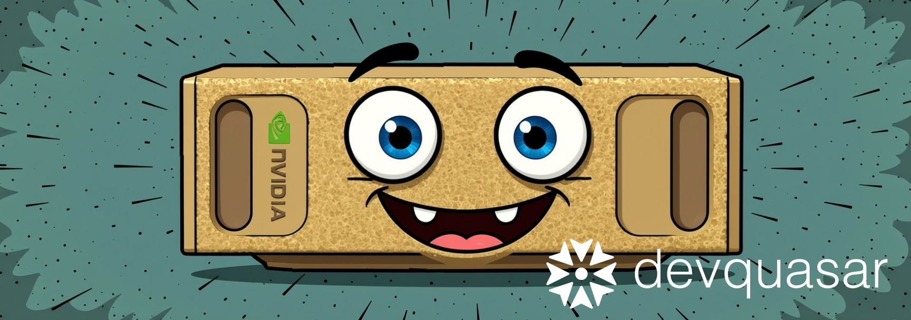

  

# DGX Spark Community Playbooks

A community-driven collection of playbooks for NVIDIA DGX Spark devices with Blackwell architecture.

## About

This repository is a **community playbook collection** where DGX Spark enthusiasts can share tutorials, experiments, and configurations. It is inspired by and follows the structure of the official NVIDIA DGX Spark Playbooks.

**Contributions are welcome!** If you've built something interesting with your DGX Spark, we'd love to see your playbook here.

## Official Resources

- **Official NVIDIA DGX Spark Playbooks**: https://github.com/NVIDIA/dgx-spark-playbooks
- **NVIDIA Documentation**: https://www.nvidia.com/en-us/products/workstations/dgx-spark/
- **DGX Spark Developer Forum**: https://forums.developer.nvidia.com/c/accelerated-computing/dgx-spark-gb10
- **DGX Spark Projects (Community)**: https://forums.developer.nvidia.com/c/accelerated-computing/dgx-spark-gb10/dgx-spark-gb10-projects/723

## Available Playbooks

| Playbook | Description |
|----------|-------------|
| [Dual DGX Spark Distributed Inference](playbooks/dual-dgx-spark-setup/) | Run 200B+ models across two DGX Sparks with 200Gbps RDMA, vLLM, and Claude Code automation |
| [Heterogeneous Distributed Inference over RDMA](playbooks/heterogeneous-distributed-inference-rdma/) | Set up distributed inference between DGX Spark and a Linux workstation over 100Gbps RDMA/RoCE v2 |

## Contributing

Contributions are welcome! If you have a playbook to share:

1. Fork this repository
2. Create your playbook under `playbooks/your-playbook-name/`
3. Include a `README.md` with step-by-step instructions
4. Submit a pull request

### Playbook Guidelines

- Include clear prerequisites and requirements
- Provide step-by-step instructions
- Add troubleshooting tips for common issues
- Document what you've actually tested

## Why This Repo?

The official [NVIDIA DGX Spark Playbooks](https://github.com/NVIDIA/dgx-spark-playbooks) repository is a mirror of an internal NVIDIA repo and cannot accept community contributions. This repository provides a space for the community to share their own playbooks and experiments.

## License

Content in this repository is provided for educational purposes. Please refer to individual playbooks for specific attribution.

---

*Maintained by [DevQuasar](https://devquasar.com/)*
